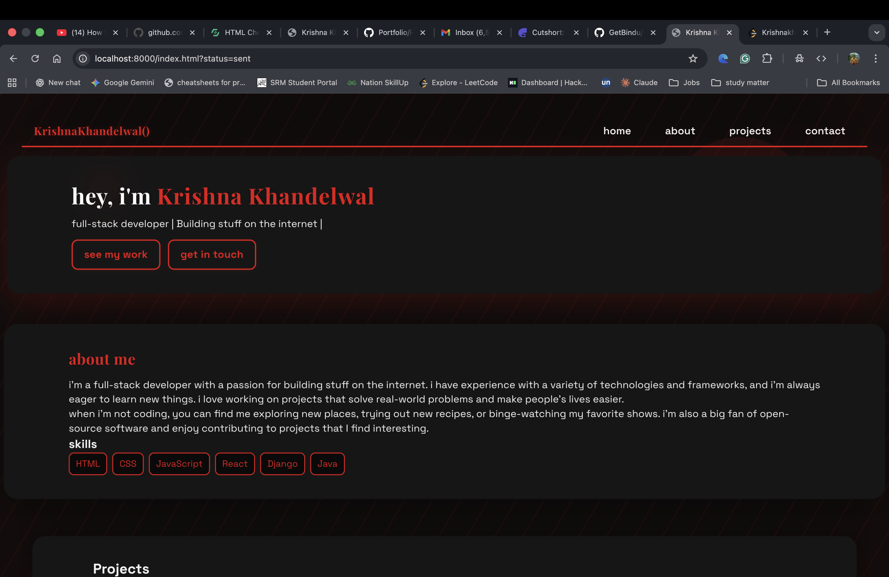

# Krishna Khandelwal | Portfolio

A modern, animated, and responsive personal portfolio website built with HTML, CSS, JavaScript, and PHP (for contact form handling).

## Features
- Gen Z/modern aesthetic with black & red color palette
- Animated background and preloader
- Responsive design for all devices
- Scroll zoom and hover effects
- Contact form with email functionality (PHP backend)
- Project showcase with GitHub and Live Demo links
- Clickable contact info boxes

## Demo
[View Live Demo](#) <!-- Add your live link here if hosted -->


## Screenshots

### Home Page


### Get in Touch


### About Me


### Contact Me


## Demo Video
<!-- Replace demo.mp4 with your actual video or use a GIF for better GitHub compatibility -->


## Getting Started

### Prerequisites
- [PHP](https://www.php.net/downloads.php) (for contact form)
- [Git](https://git-scm.com/)

### Local Setup
1. **Clone the repository:**
	```sh
	git clone https://github.com/Krishnak8080/Portfolio.git
	cd Portfolio
	```
2. **Start a PHP server:**
	```sh
	php -S localhost:8000
	```
3. **Open in your browser:**
	```
	http://localhost:8000/index.html
	```

### Deploying
- You can deploy the static files to any web host.
- For the contact form to work, your host must support PHP and allow sending mail.

## Contact
- Email: [khandelwalkrishna8080@gmail.com](mailto:khandelwalkrishna8080@gmail.com)
- [LinkedIn](https://www.linkedin.com/in/krishna-khandelwal-8080/)
- [GitHub](https://github.com/krishnakhandelwal8080)

## License
This project is open source and available under the [MIT License](LICENSE).
# Portfolio
My Portfolio
